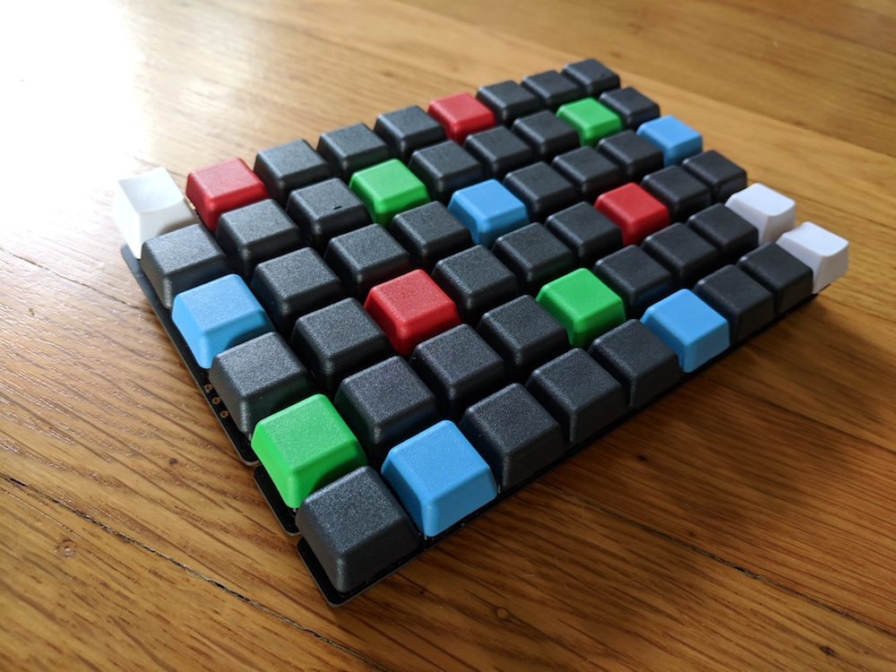

# The Waffletone

Waffletones are a kind of musical instrument.

One-handed version


Two-handed version

(Ignore the printed letters on this one!  These were the keycaps I had lying around.)

## Table of Contents

- [The Waffletone](#the-waffletone)
  * [The idea](#the-idea)
  * [The physical object](#the-physical-object)
- [Design criteria](#design-criteria)
- [How to play it](#how-to-play-it)
  * [Note layout](#note-layout)
  * [Scales](#scales)
  * [Chords](#chords)
  * [Recommended MIDI software](#recommended-midi-software)
- [Building the hardware](#building-the-hardware)
  * [Vocabulary / Parts of a keyboard](#vocabulary---parts-of-a-keyboard)
  * [Resources](#resources)
  * [Supplies list](#supplies-list)
    + [Plate vs PCB mount switches](#plate-vs-pcb-mount-switches)
    + [Keyswitch choices](#keyswitch-choices)
    + [Keycap choices](#keycap-choices)
  * [Soldering](#soldering)
  * [Soldering the microcontroller](#soldering-the-microcontroller)
  * [Enclosure](#enclosure)
  * [Extra Knobs](#extra-knobs)
  * [Ergonomics](#ergonomics)
  * [Bluetooth](#bluetooth)
  * [Power](#power)
  * [MIDI port](#midi-port)
- [Firmware](#firmware)
  * [QMK for the Waffletone](#qmk-for-the-waffletone)
  * [Example QMK note layout](#example-qmk-note-layout)
- [Prior art / similar things](#prior-art--similar-things)
- [Housing](#housing)


## The idea

It's a grid of square buttons with a regular (isomorphic) layout of notes.  Go up one square to increase pitch by one semitone; go right one square to add 3 semitones (a minor third).

## The physical object

This document describes one way to build a Waffletone using typing-keyboard hardware.

It acts like a USB MIDI keyboard -- plug it into a host device (computer, ipad) and it sends MIDI events over USB.  But it's built out of hardware usually used for computer (typing) keyboards.

It doesn't make sound by itself.  It needs a host device running a synthesizer which makes sound.

# Design criteria

* Notes are arranged with regularity so that transposing is easy (unlike a piano or guitar)
* Notes are arranged to allow easy understanding of chords
* It requires minimal hand or finger force to play
* It places the hands and arms in an ergonomic position

# How to play it

It's best played while sitting in an ergonomic chair at a desk, as if typing on a computer.

## Note layout


Notes are arranged in a regular grid.
Move up one button to +1 semitone.
Move right one button to +3 semitones (a minor third interval).

**Think of vertical columns as strings** which increase in pitch as you move up them.  And each string is higher than the last as you move to the right.

This is similar to a chromatic button accordion (C system) except that's slanted into a hexagonal grid, and this is in a square grid.

The colorful keys are landmark notes (C, F, and G).

Special keys:
* FN: lets you re-use some of the note buttons to do other things: transpose the whole keyboard; change the computer speaker volume
* Octave drop: lowers all notes by 2 octaves while held down.
* Sustain: acts like the sustain pedal on a piano.

## Scales

The major scale is inherently irregular and makes an idiosyncratic shape.


I think of it as THE EYE:


(The EYE image is shifted up by one square; it's old.  I later decided to shift the grid on my Waffletone.)


## Chords

Each flavor of chord, like a major chord, always makes the same shape on the grid no matter how you transpose it.
That means you only need to learn each flavor or chord once and then you can play it in any key.

Each finger of your (right) hand corresponds to one of the 4 common notes in a chord:
* index finger: root note (most chords) or second (sus2)
* middle finger: third (major or minor chords) or fourth (sus4)
* ring finger: fifth (or augmented or diminshed chords)
* pinky: seventh (major seventh, seventh, or sixth chords)


The dark box shows a full set of 12 keys in an octave.  Chords tend to stay in this box.  Dark red keys are the best way to play a chord; light red keys are other places you can play the same notes (in various octaves).


On a Waffletone with at least 5 rows you can play any chord in any key without wrapping around.  If you have 4 or fewer rows you will have to wrap around the top/bottom edge for some chords, changing the shape.

## Recommended MIDI software

(What is MIDI?  It's a format for sending notes over wires.  It doesn't send *audio*, only descriptions of which notes to play and at what volume.  You need an app to convert those descriptions into actual sound.)

Plug your Waffletone into an iPad and use these apps to make sound:

* Garage Band
* [Thumbjam](https://thumbjam.com/) has a built-in menu for downloading more sounds, which includes a lot of real instruments.

Note that to connect to an iPad you need a [lightning to USB adapter](https://www.apple.com/shop/product/MD821AM/A/lightning-to-usb-camera-adapter).  If your Waffletone draws a lot of power over USB, you'll need the version of the adapter which also allows charging the iPad at the same time.

On a desktop, use a DAW (digital audio workstation) app.  These are complex and can be imtimidating; look for a getting-started tutorial.

* Garage Band
* [Ableton Live](https://www.ableton.com/)
* [Bitwig Studio](https://www.bitwig.com/en/home.html)

Or on a desktop, a simpler "VST host" app combined with a VST synth plugin.

* [Cantabile Lite](https://www.cantabilesoftware.com/free-vst-host<Paste>) - Free VST host for windows
* [A list of some free VST synth plugins](https://blog.landr.com/the-7-best-free-synth-vst-plugins/) which I haven't tried

# Building the hardware


We're using the same hardware used by the DIY mechanical keyboard enthusiast community.  (Typing keyboard hardware, not piano keyboard hardware.)
They call these grid-shaped layouts "ortholinear keyboards".
The smallest usefully playable grid is about 7 wide and 5 tall.  An ideal size is 12 wide and 6 tall.

You can make a single large flat keyboard or a split keyboard with one piece for each hand.
The split keyboard can be "tented" (lifted in the middle) for better ergonomics, but that means the hands are separated by a gap and can't help each other play patterns.
In this document we're building only one side of the BFG-9000 split keyboard as a prototype.

## Vocabulary / Parts of a keyboard

**Microcontroller** - The brains.  It's a thumb-sized board with a microcontroller and a USB port.
The standard one is a "Pro Micro" which is an Atmel ATmega24u4 chip, the same used in the Arduino Micro.  Many premade keyboard PCBs are designed to match its footprint.

**PCB** - The large circuit board that the keys attach to.  You can also hand-wire the keys to each other if you don't have a PCB.

**Plate** - A thin material with holes cut for each key.  Often made from acrylic or steel.  This gives mechanical support to the keys.  They keys can also be supported only by the PCB but that's more fragile.

**Mechanical keyswitch** - The guts of each key, containing a spring.  Cherry MX is the original brand but now there are many imitators.  Gateron is the most common.
Keyswitches come with different spring strenghts and different tactilities (smooth, clicky).  These are named after colors and the plastic of the keyswitch is color-coded to match the name.

**Keycap** - The part of the key you touch.  These come in a wide variety of shapes, colors, and materials.  You will need "cherry mx" compatible keycaps in "1x1" size, probably blank (no letters printed on them).

**TRRS cable** - If you're making a split keyboard, the two sides will communicate over this cable.  It's the same kind of cable used for headphones that also have microphones - a 4 conductor 1/8 inch audio jack - but in this case data is going over the cable.  Some are wired differently, so buy one from a keyboard vendor to make sure it works.

## Resources

Forums:

* [Reddit: OLKB](https://www.reddit.com/r/olkb/)
* [Reddit: MechanicalKeyboards](https://www.reddit.com/r/MechanicalKeyboards/)

Similar existing keyboards you can buy:

* [BFO-9000](https://keeb.io/collections/frontpage/products/bfo-9000-keyboard-customizable-full-size-split-ortholinear?variant=8116065271914) - split, 9 x 6 on each side.  This is what we're using in this prototype.
* [Viterbi](https://keeb.io/collections/frontpage/products/viterbi-keyboard-pcbs-5x7-70-split-ortholinear) - split, 7 x 5 on each side
* [Preonic](https://olkb.com/) - single piece, 12 x 5, hard to find

Keyboard-specific helper tools:

* [Keyboard Layout Generator](http://www.keyboard-layout-editor.com/) -- here is [a layout for BFO-9000](http://www.keyboard-layout-editor.com/#/gists/0dd473c2262c1fbf7df6f6164264f312)
* [Plate & Case Builder](http://builder.swillkb.com/) -- generates SVG outlines for laser cutting an enclosure
* [generate PCB from keyboard layout](https://kalerator.clueboard.co/)

Or make your own PCBs from scratch:

* [Upverter](https://upverter.com/dashboard/) - design PCBs online
* [OSHPark](https://oshpark.com/) - order PCBs

## Supplies list

In this case we're building a one-handed version with 6 x 9 buttons.

| Kind of item     | Specific item                         | # items needed | items / pack | # packs needed | cost / pack | total cost | link                                                                                                      |
|------------------|---------------------------------------|----------------|--------------|----------------|-------------|------------|-----------------------------------------------------------------------------------------------------------|
| Keyboard PCB     | BFO-9000 keyboard PCB (one side only) | 1              | 2            | 1              | $20         | $20        | https://keeb.io/products/bfo-9000-keyboard-customizable-full-size-split-ortholinear?variant=8116065271914 |
| Controller board | Elite-C pro micro compatible board    | 1              | 1            | 1              | $18         | $20        | https://keeb.io/products/elite-c-usb-c-pro-micro-replacement-arduino-compatible-atmega32u4                |
| Keyswitches      | Gateron Silent Clear                  | 54             | 10           | 6              | $3.80       | $22.80     | https://novelkeys.xyz/products/gateron-silent-switches?variant=19441364172893                             |
| Keycaps          | G20 1 unit keycap, various colors     | 54             | 10           | 6              | $10         | $60        | https://pimpmykeyboard.com/g20-1-space-pack-of-10/                                                        |
| Enclosure        | wood or laser cut acrylic             | 1              | 1            | 1              | $10         | $10        | DIY                                                                                                       |
| USB cables       | magnetic breakaway USB-C cable        | 1              | 1            | 1              | $10         | $10        | https://www.amazon.com/gp/product/B07H2T12HM/ref=ppx_yo_dt_b_search_asin_title?ie=UTF8&psc=1              |
|                  |                                       |                |              |                |             |            |                                                                                                           |
|                  |                                       |                |              |                |             | **$142**   | **grand total**                                                                                           |

You can get cheaper keycaps from Amazon: [link1](https://www.amazon.com/Profile-Keycaps-Switches-Mechanical-Keyboard/dp/B06XK8BD4G/ref=sr_1_2?keywords=cherry+keycaps+blank&qid=1552427878&s=gateway&sr=8-2) [link2](https://www.amazon.com/Keycaps-Non-Backlit-Switches-Mechanical-Keyboard/dp/B07G9DHJT4/ref=sr_1_3?keywords=cherry%2Bkeycaps%2Bblank&qid=1552427955&refinements=p_85%3A2470955011&rnid=2470954011&rps=1&s=gateway&sr=8-3&th=1#customerReviews) [link3](https://www.amazon.com/Profile-Keycaps-Switches-Mechanical-Keyboard/dp/B06XK984SB/ref=sr_1_12?keywords=cherry+keycaps+blank&qid=1552427955&refinements=p_85%3A2470955011&rnid=2470954011&rps=1&s=gateway&sr=8-12)

Also: [Wii Nunchuck](https://www.adafruit.com/product/342) and its [Proprietary Plug adapter](https://www.adafruit.com/product/345) so we can have a joystick to use for pitch bends.

It's a good idea to use magnetic USB cables to avoid damage to the microcontroller board if the USB cable gets yanked.  The USB socket on the microcontroller can be easily torn off the board.

### Plate vs PCB mount switches

I recommend PCB Mount switches, not Plate Mount switches.  You want the extra plastic nubs to orient and strengthen the switches.


Some keyboards have a "plate" - an extra layer of material above the PCB that the switches snap into for mechanical stability.  You don't need one, but some people like them.  They also help if you're going to switch the keycaps frequently since that has a chance of pulling the entire switch off the PCB.

In this picture there is a top plate (metal with square holes), a PCB for electrical connections (not visible), and then a bottom plate (solid metal).  Spacers hold the two metal plates together, and the PCB floats in the middle, only held by its solder connections to the switches.


A plate can be 3d printed, cut from metal or acrylic, or manufactured as a PCB that happens to have no electronics in it.  Keebio sells [acrylic plates](https://keeb.io/collections/keyboard-pcbs/products/bfo-9000-keyboard-customizable-full-size-split-ortholinear?variant=8116065271914) for the BFO-9000.

### Keyswitch choices

I recommend "silent" keyswitches because the clack of keys will distract from the music.
I recommend "linear" keyswitches which don't have a tactile click, but this is personal preference.
Gateron Silent Clear has the lightest available spring of any keyswitch, for easy pressing.
When you play the Waffletone you have to press and hold many keys for an extended time, so lighter springs will keep your hands from getting tired.

### Keycap choices

I like the G20 profile keys (which are flat on top) because it's easier to slide your fingers across them.
DCS and XDA would also be ok choices.  XDA is hard to find.
DSA has an upper surface that's too small.
I recommend against the taller keycaps because they would wobble too much.


There are also "Kailh Choco Low Profile Switches" which are very flat and might be a good choice.
They feel more like Macbook chiclet keys.
They use different keyswitches which fit into differently shaped holes in the PCB and are not Cherry MX compatible.  Some PCBs have extra holes to support them.

## Soldering

Follow this [build guide for the BFO-9000](https://docs.keeb.io/nyquist-build-guide/) except we're only building one of the two hands of the keyboard.

This other [build guide](https://docs.keeb.io/iris-build-guide/) has tips on soldering the diodes.

Solder in this order so things won't get in the way of each other:

1. Diodes
2. Headers for the microcontroller
3. Keyswitches
4. Microcontroller itself

## Soldering the microcontroller


This is how to solder the microcontroller to the large PCB, viewed from the underside of the keyboard (which says "BFO-9000").

There are five extra pins along the bottom which could be used for extra knobs, joysticks, or toggle switches.  More switches could also be added as an extra virtual row in the key grid.

The pink rectangles mark pins which support analog IO.  We might want to use some of them later to add a joystick or something.

The "RGB" pin connects to some holes on the side edge of the BFO PCB - it's intended for connecting to a strip of addressible LEDs such as NeoPixels, but we're not using it.

The SDA and SCL pins are routed to the TRRS (headphone style) connector along the top of the BFO PCB, to communicate with the other hand's keyboard.
These are the native I2C pins of the microcontroller.  The QMK firmware communicates over these pins using serial by default but can also use I2C.
For now we're only making a one-handed board so this can be re-used to talk to a Wii Nunchuk over I2C.

On most Pro Micros, `RAW` is the VCC power from USB or something like that.  The BFO PCB either doesn't use it or connects it to VCC.  However the Elite-C uses this pin to expose an additional IO port.  We're not soldering it to the BFO, but it could be connected directly to some other accessory.

## Enclosure

You'll have to figure out your own enclosure.  I'm planning to make a wood enclosure with integrated wrist-rest like this:


...but with some extra knobs along the top.

## Extra Knobs

I'm planning to add some extra controls:

* Toggle switch or knob with detents for changing MIDI channel (to change instrument sound made by the synth software)
* Knob with detents for transposing in octives
* 1/4 jack to connect a piano pedal for sustain
* A joystick or whammy bar for pitch bend and vibrato.  In this case I'm using a Wii Nunchuk which communicates over I2C.

The controls might look like this, but in a single row above the key grid:


You can also set up a function key and re-use the normal key grid to change your settings.  See the Firmware section below for details.

## Ergonomics

It's best to "tent" a split keyboard by lifting the inner edges so your hands are tilted.
In this case I want to add folding feet on both sides so you can set up this one-handed instrument to be played by either hand.

I usually choose instrument sounds which don't require me to hold down the key to keep a sound going - the sound is triggered and then rings for a while.
Xylophone, dulcimer, and harp are good examples.

## Bluetooth

You could make a Bluetooth Waffletone by using something like [this](https://www.adafruit.com/product/2829) or [this](https://www.adafruit.com/product/4062) controller board instead of a Pro Micro.
It's possible but tricky and annoying to connect these as a MIDI device over Bluetooth Low Energy to iOS and to Macs.
It works with a range of about 8 feet, then you start getting latency and dropped notes.
You would also need to add batteries and a charging controller since you wouldn't be powered over USB.

You can also use the same hardware that wireless mouse dongles use to connect to their little USB receivers - is it 2.4ghz?  That would be more reliable than Bluetooth and faster to set up.  Adafruit sells these transmitters but I don't remember what they're called.  nRF something.

## Power

If your Waffletone draws more than 500mA, iPads will refuse to connect unless they are also plugged into wall power.

USB devices advertise how much power they want when they're plugged in.  You can change this in the QMK firmware so that iPads won't complain - otherwise it defaults to 500mA.  In my firmware below, I added `#define USB_MAX_POWER_CONSUMPTION 100` in the file `keyboards/keebio/bfo9000/keymaps/waffletone/config.h`

## MIDI port

You could add an old fashioned MIDI cable port if you wanted to plug it into older synthesizers.

These use low-bandwidth serial connections which the microcontroller should be able to support, but the QMK firmware doesn't have this feature.  You'd have to add it to QMK or write your own firmware.

Note that those old fashioned MIDI cables don't supply power.

# Firmware

Most mechanical keyboards run [QMK](https://qmk.fm/) which is an easy-to-customize firmware.

QMK can act as a USB MIDI device and send MIDI events.
Its support for MIDI is [not documented well](https://beta.docs.qmk.fm/features/feature_audio#midi-functionality) -- maybe [these docs are better](https://github.com/qmk/qmk_firmware/pull/1112).
Note that you don't want "Audio" features - those are piezo beeps - you want MIDI.  Check my fork below for how to enable it.

Instead of using QMK, you could also write your own firmware using the Arduino IDE.  The Pro Micro controller board can act as a USB MIDI device if you choose the right settings in the Arduino IDE menus.  You might go down this path if you wanted to add knobs or joysticks, or if you're adding an old fashioned MIDI plug which uses serial data instead of sending MIDI over USB.

## QMK for the Waffletone

My version of QMK is here:

https://github.com/cinnamon-bun/qmk_firmware/commits/keebio_bfo9000_waffletone

Check out that git repo and make sure to switch to the `keebio_bfo9000_waffletone` branch.

This adds a 9x6 Waffletone layout to QMK along with some MIDI configuration and a new key function `MIDI_DEEP` which temporarily drops the keys two octaves while held down.  This layout file only sets up one side of the BFO-9000 board since we only built one of them; if you built two hands-worth of board, you'll need to improve the keyboard layout file.

The keyboard layout file is `keyboards/keebio/bfo9000/keymaps/waffletone/keymap.c` - you can change the note layout and function keys here.  In that file the first grid contains the normal MIDI note layout, and the second is the "function layer" which is activated when the FN key is held down.  The right-hand half of the grid is the other hand's keyboard which we are not building in this case, and it still contains computer-keyboard keycodes instead of MIDI notes.

There are also two shell scripts at the root folder `waffletone-make.sh` and `waffletone-flash.sh` which will help you build the code and flash the board.

To flash the firmware onto the board,
* plug it into your computer by USB
* push and release the reset button on the back of the BFO-9000
* within a few seconds, run `./waffletone-flash.sh`

## Example QMK note layout

This is an example keymap from the smaller, two-handed Waffletone which was built on a Keebio Viterbi board.

The right hand's upper left key is a function key which enables the second keymap layer with transpose controls.
It also has volume adjustment keys which work the same as keys on a regular computer keyboard.

The top left and bottom right keys are the least-used for playing music so they're good places for extra functionality.

I added the keycode `MI_MOD` which is like a sustain pedal but in toggle mode instead of momentary.


```c
  // sustain                                                    function
  // toggle                                                     function
  //+-------+-------+-------+-------+-------+-------+-------+   -------+-------+-------+-------+-------+-------+-------+
     MI_MOD ,MI_C_1 ,MI_Ds_1,MI_Fs_1,MI_A_1 ,MI_C_2 ,MI_Ds_2,     FN1  ,MI_C_3 ,MI_Ds_3,MI_Fs_3,MI_A_3 ,MI_C_4 ,MI_Ds_4,
  //+-------+-------+-------+-------+-------+-------+-------+   -------+-------+-------+-------+-------+-------+-------+
     MI_Gs  ,MI_B   ,MI_D_1 ,MI_F_1 ,MI_Gs_1,MI_B_1 ,MI_D_2 ,   MI_Gs_2,MI_B_2 ,MI_D_3 ,MI_F_3 ,MI_Gs_3,MI_B_3 ,MI_D_4 ,
  //+-------+-------+-------+-------+-------+-------+-------+   -------+-------+-------+-------+-------+-------+-------+
     MI_G   ,MI_As  ,MI_Cs_1,MI_E_1 ,MI_G_1 ,MI_As_1,MI_Cs_2,   MI_G_2 ,MI_As_2,MI_Cs_3,MI_E_3 ,MI_G_3 ,MI_As_3,MI_Cs_4,
  //+-------+-------+-------+-------+-------+-------+-------+   -------+-------+-------+-------+-------+-------+-------+
     MI_Fs  ,MI_A   ,MI_C_1 ,MI_Ds_1,MI_Fs_1,MI_A_1 ,MI_C_2 ,   MI_Fs_2,MI_A_2 ,MI_C_3 ,MI_Ds_3,MI_Fs_3,MI_A_3 ,MI_C_4 ,
  //+-------+-------+-------+-------+-------+-------+-------+   -------+-------+-------+-------+-------+-------+-------+
     MI_F   ,MI_Gs  ,MI_B   ,MI_D_1 ,MI_F_1 ,MI_Gs_1,MI_SUS ,   MI_F_2 ,MI_Gs_2,MI_B_2 ,MI_D_3 ,MI_F_3 ,MI_Gs_3,MI_B_3
  //+-------+-------+-------+-------+-------+-------+-------+   -------+-------+-------+-------+-------+-------+-------+
  //                                                 sustain
  ),

  [_FN] = KC_KEYMAP(
  //|----+----+----+----+----+----+-------+       ------+---------+---------+---------+----------+----------+--------|
         ,    ,    ,    ,    ,    ,       ,             ,MI_OCT_N1,MI_OCT_0, MI_OCT_1 ,MI_OCT_2  ,MI_OCT_3  ,        ,
         ,    ,    ,    ,RST ,    ,       ,             ,         ,MI_TRNS_2,MI_TRNS_5,MI_TRNS_N4,MI_TRNS_N1,        ,
         ,    ,    ,    ,    ,    ,       ,             ,         ,MI_TRNS_1,MI_TRNS_4,MI_TRNS_N5,MI_TRNS_N2,        ,
         ,    ,    ,    ,    ,    ,       ,             ,         ,MI_TRNS_0,MI_TRNS_3,MI_TRNS_6 ,MI_TRNS_N3,        ,
         ,    ,    ,    ,    ,    ,MI_SUST,             ,         ,         ,         ,MUTE      ,VOLD      ,VOLU
  //|----+----+----+----+----+----+-------+       ------+---------+---------+---------+----------+----------+--------|
  )

```

Meaning of some keycodes:
* `MI_Ds_3` is a MIDI note for Dsharp in octave 3
* `FN` is the function key which switches to the second layer of keys
* `MI_OCT_2` transposes all the notes up to octave 2.  They stay that way until the keyboard loses power.
* `MI_TRNS_2` transposes all notes up to 2 semitones above their normal value.
* `MI_SUS` is like a piano sustain pedal - while held down, all notes continue playing after you release them
* `MI_DEEP` temporarily drops all notes by 2 octaves while held down
* `MUTE`, `VOLD`, `VOLU` change the volume of the attached computer or iPad.  These are the same as the volume buttons on a typing keyboard.

# Prior art / similar things

Apps

* [MinorThirds](https://www.youtube.com/watch?v=1ktnz6aP668) (iOS)
  * Happens to have the same note layout as a Waffletone
  * The author has performance videos [on Youtube](https://www.youtube.com/watch?v=xYNzZSO5j34)
  * [They also built](https://www.youtube.com/watch?v=5go2zA8dZQM) a Waffletone-style keyboard out of a point of sale keyboard
  * Rather than modifying the keyboard firmware, they have a program running on the computer to convert keystrokes into MIDI.  [It's on GitHub](https://github.com/vinicius-mello/keymidi)
* [Musix Pro](https://shiverware.com/musixpro/) (iOS)
  * Allows you to set up any kind of square or hex grid
  * You can configure a Waffletone style grid in this app: going up adds 1 semitone; going right adds 3 semitones

Gadgets with grids of buttons that send MIDI

* [Linnstrument](http://www.rogerlinndesign.com/linnstrument.html)
  * Has a different note layout - guitar/bass style fourths instead of minor thirds, with strings running horizontally
  * Hackable firmware to acheive Waffletone layout - [here's a patch](https://github.com/rogerlinndesign/linnstrument-firmware/pull/36)
  * Pressure sensitive
  * Buttons have no travel and are only pressure sensitive.  Requires continuous hand force to play - not ergonomic
  * Can't play certain combinations of notes due to sensor limitations (it can't detect all 4 notes in the corners of a rectangle).  This doesn't happen often in a Waffletone layout.
* [Ableton Push](https://www.ableton.com/en/push/)
  * 8 x 8
  * Same layout as a Linnstrument
  * Can also be put in "scale mode" where each row of 8 notes is one octave's-worth of a scale (diatonic) instead of including all 12 notes per octave (chromatic)
  * Pressure sensitive
  * Requires more hand force to play - not ergonomic
* Novation Launchpad
  * 8 x 8
  * Similar to Ableton Push but cheaper
* [Monome](https://monome.org/docs/grid/)
  * 16 x 8
  * Tiny squishy buttons, designed more for sequencing instead of realtime performance
* [Midi Fighter](https://www.midifighter.com/)
  * 4 x 4 (too small) or 8 x 8
  * Grid of large arcade buttons
  * Buttons might be too large to comfortably play chords using Waffletone note layout
  * Often used to [trigger samples](https://www.youtube.com/watch?v=6ZcaXikDUqU) rather than playing notes, but it's configurable
* [Axis64](https://www.c-thru-music.com/cgi/?page=prod_axis-64) and Axis49 were hex-grid keyboards that sent MIDI.  Now out of production, maybe available used if you can find one

The grids-of-buttons listed above typically send generic MIDI and might require fancy software on a desktop to map the MIDI to notes in the way you want.  Some of them have lights under each button which can be controlled by sending special MIDI messages from the desktop back to the device.

Acoustic instruments with regular note spacing, in general

* [Chromatone](https://chromatone.jp/)
  * Like a normal piano MIDI keyboard but in Janko layout
  * You can also make your own DIY Janko keyboard by gluing LEGOs to a piano keyboard
* Chromatic button accordions
  * C-system button accordions have the same layout as Waffletone, but skewed from a square grid into a hex grid
  * B-system accordions have a mirrored or transposed layout, I think
* [Harpejji](https://www.marcodi.com/) - strings spaced in regular intervals of a major second (2 semitones)
* Bass guitar - strings spaced in regular intervals of a fourth (5 semitones)
* Mandolin - strings spaced in regular intervals of a fifth (7 semitones)

Other isomorphic key layouts

* [Janko](https://en.wikipedia.org/wiki/Jank%C3%B3_keyboard), rarely used in piano-like instruments
* [Wicki-Hayden](https://en.wikipedia.org/wiki/Wicki-Hayden_note_layout), used by some [http://www.concertina.com/hayden-duet/](concertinas)

Other homebrew isomorphic keyboards.  Both of these use Wicki-Hayden layouts

* [The Thummer](https://www.wired.com/2007/01/the-thummer-a-m/)
* [The Jammer](https://en.wikipedia.org/wiki/Jammer_keyboard)

Grid-shaped typing keyboards ("ortholinear" keyboards)

* [BFO-9000](https://keeb.io/products/bfo-9000-keyboard-customizable-full-size-split-ortholinear?variant=8116065271914)
* Planck and Preonic by [OLKB](https://olkb.com/)

# Housing

There is a 3d CAD model for a housing made of stacked planks of laser-cut or CNC cut plywood: [housing-openjscad.js](housing-openjscad.js)

The top of that file contains instructions on how to use it.
It hasn't been tested yet in the real world so the dimensions might need adjustment.


